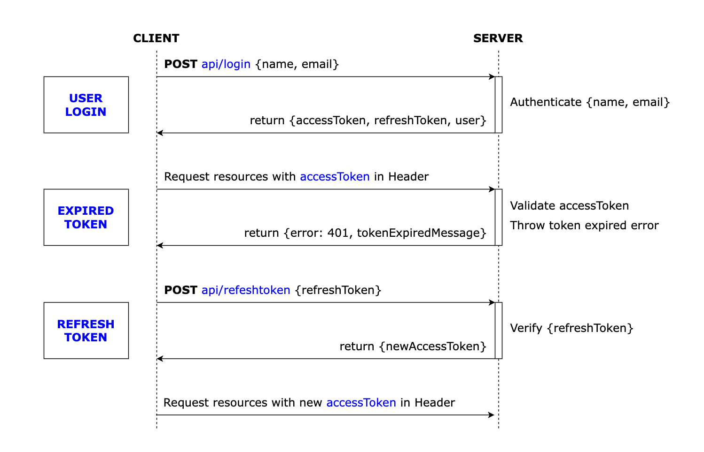

# Refresh token

With the help of Axios Interceptors, React App can check if the accessToken (JWT) is expired (401), sends /refreshtoken request to receive new accessToken and use it for new resource request.

